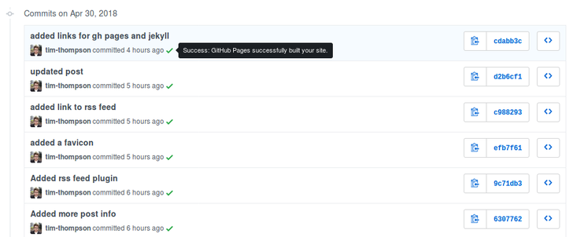

I have built my fair share of Wordpress sites over the last few years. Despite services like Digital Ocean making setup a breeze, I find Wordpress to be clunky and unintuitive. For a CMS focussed on content creation/blogging I am astounded by how flaky the editor is. So for my own simple dev blog I settled on using [Jekyll](https://jekyllrb.com/) with [GitHub Pages](https://pages.github.com/) to hack together something simple, fast and free that suits my needs perfectly. And so far I love it!


[GitHub Pages](https://pages.github.com/) is a free service offered by GitHub to host static websites from a git repository. It has built in support for [Jekyll](https://jekyllrb.com/), a static site generator that takes markdown files and converts them into static web pages. It has become a useful tool for many open source groups that use it for hosting documentation. The [Jekyll](https://jekyllrb.com/) documentation is itself hosted on [GitHub Pages](https://pages.github.com/) with [Jekyll](https://jekyllrb.com/).

Many of the tutorials for [GitHub Pages](https://pages.github.com/) and [Jekyll](https://jekyllrb.com/) focus on getting the site running locally using Ruby. As somebody that has never used Ruby and only wanted to hack together something simple I couldn't be bothered with getting set up and learning about gem files. So I ended up doing most of my site modifications using the Github editor.

The commits are a little messy, but as it didn't matter if I wrecked the site at any point I don't really care! For larger changes and writing posts I have the whole repository cloned to my dev machine. But I don't run it locally at all. I lose some functionality around drafts but at the end of the day it's a markdown file so I know roughly what it will look like.

Even if there are problems, the workflow for updating is so quick thanks to [GitHub Pages](https://pages.github.com/) auto building the site within seconds of each commit, that making fixes is quick and easy.



I'm not going to write a tutorial for setting up a [Jekyll](https://jekyllrb.com/) site on [GitHub Pages](https://pages.github.com/) (not right now anyway) as the official documentation is pretty good, and there are thousands of tutorials already covering the process in painstaking detail. I have more interesting things to tinker with and write about! Here are some links to get you started.

* [Getting Started with GitHub Pages](https://guides.github.com/features/pages/)
* [Jekyll Docs](https://jekyllrb.com/docs/home/)

Instead I'd like to highlight a couple of cool things I found. First up the [Liquid Template Language](https://shopify.github.io/liquid/) used by [Jekyll](https://jekyllrb.com/). For anyone familiar with [Jinja2](http://jinja.pocoo.org/docs/2.10/) the syntax will feel very familiar.

Liquid has many built in functions for processing the content it displays. For example on my homepage the below snippet of code renders an excerpt of each post.


```liquid
{{ post.date | date: "%-d %B %Y" }}
{{ post.content | number_of_words | divided_by: 190 | append: " minutes to read" }}
{{ post.excerpt }}
```


This snippet does some cool things. Liquid allows applying filters to objects in curly braces. For example the first line of the snippet applies a date filter that converts the post date '2018-04-29', stored in the post filename, to '29 April 2018'.

The second line of the snippet shows how filters can chain together. It takes the number of words in the post content and divides it by 190, an average words per minute value I found on Google, and appends some text.

This means I can display a quick and dirty 'minutes to read' value calculated client side from the post content.

The final line uses a feature of [Jekyll](https://jekyllrb.com/). The excerpt data item is part of the post's data hash and by default is made up of the first block of text in the post. But, this can be customised using an excerpt_separator.

For a quick and easy setup similar to many CMSes Jekyll offers a theming function. For this site I used the open source [Minimal Theme](https://github.com/pages-themes/minimal) for Jekyll.

I've modified it to suit my tastes which is incredible easy to do. Overriding any CSS values for example can be done easily. CSS modifications and layout modifications have made up the most of the changes I have made. Feel free to compare this site to the example site for [Minimal](https://github.com/pages-themes/minimal).


The main changes I made to the styling were increasing the width and font size of the site to make it slightly more readable. But it would be entirely possible to use the theme as a base to make large sweeping changes.

Importing a theme in the config adds the files from the theme to your project at build time. So if you plan to do a major customisation of a theme it might be worth pulling the entire theme into your repository rather than importing it. This will make it slightly easier to see everything that's going on.

For my simple needs as a techy person in need of a simple blog, GitHub Pages and Jekyll offer a perfect solution. I think it provides a fantastic free platform for learning web development and Git that is great for beginners. But it can scale to handling large amounts of documentation for complex libraries and frameworks.

If you need a static site and have the time and know how to hack around a bit, then I don't see the need for the hassle of a full CMS ever again. And that makes me very happy!